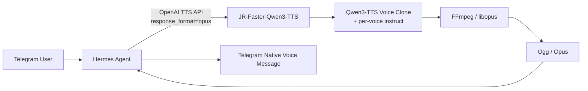

# JR-Faster-Qwen3-TTS

> 基于 [`andimarafioti/faster-qwen3-tts`](https://github.com/andimarafioti/faster-qwen3-tts) 的兼容增强版本。  
> 重点面向 **Hermes Agent、Telegram Bot、角色型 AI Agent**，增加 **每个音色独立的 `instruct` 语气控制、OpenAI-compatible Ogg/Opus 输出，以及 Hermes → Telegram 原生语音消息链路**。
>
> A compatibility-focused fork of `faster-qwen3-tts` for **Hermes, Telegram, and character/agent TTS**, adding **per-voice style instructions and real OpenAI-compatible Ogg/Opus output**.

---

## 中文说明

### 为什么做这个 Fork？

上游 `faster-qwen3-tts` 已经很好地解决了 Qwen3-TTS 的实时推理问题：

- CUDA Graph 加速；
- streaming / non-streaming；
- Voice Clone；
- VoiceDesign；
- OpenAI-compatible `/v1/audio/speech`；
- Windows / CUDA GPU 支持。

这个 JR 版本**不重写核心推理架构**，而是针对实际 Agent 部署中遇到的两个问题做增强：

1. **克隆出来的声音需要固定“角色语气”**，而不仅仅是固定音色；
2. **Hermes + Telegram 的原生语音链路需要真正的 Ogg/Opus**，而上游 OpenAI server 主要提供 WAV / PCM / MP3。

最终目标：

```text
Telegram
   |
   v
Hermes Agent
   |
   | OpenAI-compatible TTS
   | POST /v1/audio/speech
   | voice=<voice profile>
   | response_format=opus
   v
JR-Faster-Qwen3-TTS
   |
   | Qwen3-TTS Voice Clone
   | + per-voice instruct
   v
PCM 24 kHz mono
   |
   v
FFmpeg / libopus
   |
   v
Ogg / Opus
   |
   v
Telegram native voice message
```

这条链路已经完成实际运行验证。

---

## JR 版本 vs 上游版本

| 功能 | 上游 `faster-qwen3-tts` OpenAI Server | JR-Faster-Qwen3-TTS |
|---|---|---|
| Qwen3-TTS CUDA Graph | ✅ | ✅ 保持上游实现 |
| Streaming / Non-streaming | ✅ | ✅ |
| Voice Clone | ✅ | ✅ |
| Named voice profiles | ✅ | ✅ |
| OpenAI-compatible `/v1/audio/speech` | ✅ | ✅ |
| WAV | ✅ | ✅ |
| PCM | ✅ | ✅ |
| MP3 | ✅ | ✅ |
| **Ogg/Opus (`response_format=opus`)** | ❌ | **✅** |
| **每个 voice profile 独立 `instruct`** | OpenAI voice-clone 路径未传递 | **✅** |
| Streaming clone 传递 `instruct` | ❌ | **✅** |
| Non-streaming clone 传递 `instruct` | ❌ | **✅** |
| Windows voices JSON 显式 UTF-8 | 依赖系统默认 locale | **✅** |
| Hermes OpenAI TTS integration | 通用 OpenAI API | **✅ 已验证** |
| Telegram native Ogg voice | 需要额外转换 | **✅ 已验证** |

### 关于 `instruct` 的重要说明

上游 Qwen3-TTS / Faster-Qwen3-TTS **本身已经有 instruction-based 能力**，例如 VoiceDesign。

JR 版本新增的并不是“第一次让模型支持 `instruct`”，而是：

> **让 OpenAI-compatible named voice / voice-clone server 路径真正读取每个 voice profile 中的 `instruct`，并同时传给 streaming 和 non-streaming voice clone。**

这对长期运行的角色型 Agent 很重要，因为：

```text
音色 identity
+
角色语气 personality/style
```

可以一起固定下来。

---

# 1. Per-Voice `instruct`：给每个角色固定语气

例如：

```json
{
  "xiaowu": {
    "ref_audio": "voice.wav",
    "ref_text": "reference transcript",
    "language": "Auto",
    "chunk_size": 4,
    "instruct": "温柔、自然、亲切，语速适中，像是在和熟悉的人聊天"
  }
}
```

JR 版本会把：

```python
voice_cfg.get("instruct")
```

传入：

```python
generate_voice_clone_streaming(...)
generate_voice_clone(...)
```

因此同一个 cloned voice 可以长期保持指定的表达风格。

适合：

- AI 角色；
- 私人 Agent；
- Telegram Bot；
- 陪伴型角色；
- 数字人；
- 固定人格的语音助手。

仓库提供公开模板：

```text
voices.example.json
```

生产 voice sample、reference transcript 和真实 `instruct` 不应提交到公开仓库。

---

# 2. 真正的 OpenAI-compatible Ogg/Opus

上游 OpenAI server 支持的主要输出格式：

```text
wav
pcm
mp3
```

JR 版本新增：

```text
response_format=opus
```

并返回：

```http
Content-Type: audio/ogg
```

编码链路：

```text
Qwen3-TTS float audio
        |
        v
PCM16LE / 24 kHz / mono
        |
        v
FFmpeg
        |
        v
libopus
32k / VBR / application=voip
        |
        v
Ogg/Opus
```

这是**真正的 Ogg/Opus 编码**，不是把 MP3/WAV 改成 `.ogg` 扩展名。

已通过 `ffprobe` 验证：

```text
codec_name=opus
codec_type=audio
sample_rate=48000
channels=1
format_name=ogg
```

Opus 解码侧显示 48 kHz 属于正常行为；Qwen3-TTS 的原始生成仍然是 24 kHz。

---

# 3. 为什么要支持 Opus：Hermes + Telegram

这是这个 Fork 最重要的实际用途。

Hermes v0.20.6 在 Telegram voice reply 路径中使用 `.ogg` 输出文件，并映射 OpenAI TTS 格式：

```text
.ogg -> response_format=opus
```

因此 JR 版本可以直接接入：



不需要：

```text
WAV
 -> 临时文件
 -> 外部转码脚本
 -> OGG
 -> Telegram
```

也不需要为了 Qwen3-TTS 去修改 Hermes 的 Telegram adapter。

设计原则：

> **让 TTS Backend 兼容 Hermes 已有的 OpenAI TTS contract，而不是让 Agent 为某个特定 TTS Backend 改协议。**

---

# 4. Hermes 配置

Sanitized example：

```yaml
tts:
  provider: openai
  openai:
    api_key: local
    base_url: http://<TTS_HOST>:18000/v1
    model: tts-1
    voice: xiaowu
    speed: 1.0
  use_gateway: false

voice:
  auto_tts: false
```

其中：

```text
api_key: local
```

只是局域网内无认证 OpenAI-compatible endpoint 使用的 dummy value。

**不要把无认证 TTS API 直接暴露到 Internet。**

---

# 5. Hermes `/voice` 命令

在 Hermes v0.20.6 中已经验证：

### 关闭语音

```text
/voice off
```

只发送文字回复。

### Voice-only 模式

```text
/voice on
```

内部模式为：

```text
voice_only
```

主要用于收到语音输入时使用语音回复。

### 所有回复都启用 TTS

```text
/voice tts
```

内部模式为：

```text
all
```

普通文字消息也会生成 TTS。

### 查看状态

```text
/voice status
```

推荐临时 TTS 节点使用：

```text
默认：voice.auto_tts=false
TTS server 在线：/voice tts
TTS server 离线：/voice off
```

以后使用 24x7 TTS 节点时，可以根据自己的 Agent 策略调整。

---

# 6. Telegram Integration

实际验证链路：

```text
User
  |
  v
Telegram Bot
  |
  v
Hermes
  |
  | LLM response
  v
Text reply
  |
  +-----------------------------+
  |                             |
  v                             |
OpenAI-compatible TTS           |
  |                             |
  | voice=xiaowu                |
  | response_format=opus        |
  v                             |
JR-Faster-Qwen3-TTS             |
  |                             |
  v                             |
Qwen Voice Clone + instruct     |
  |                             |
  v                             |
FFmpeg / libopus                |
  |                             |
  v                             |
Ogg / Opus                      |
  |                             |
  +----------> Telegram Voice <-+
```

最终 Telegram 中收到的是原生 voice message，而不是普通文件附件。

---

# 7. Quick Start：Windows

## 7.1 Clone

```powershell
git clone https://github.com/Goldlionren/JR-Faster-Qwen3-TTS.git
cd JR-Faster-Qwen3-TTS
```

核心 Faster-Qwen3-TTS 安装方式仍参考上游项目。

当前 JR/Hermes 实际验证环境使用：

```text
Windows 11
NVIDIA RTX 4080 SUPER
PyTorch 2.11.0+cu128
Torch CUDA 12.8
Qwen3-TTS-12Hz-0.6B-Base
transformers 5.15.1
Hermes Agent v0.20.6
```

`transformers==5.15.1` 是这个已验证环境的 known-good pin；它不是宣称所有环境都必须使用该版本。

---

## 7.2 FFmpeg / libopus

确认：

```powershell
ffmpeg -hide_banner -encoders | Select-String "opus"
```

应该能看到：

```text
libopus
```

---

## 7.3 Voice Profile

复制：

```text
voices.example.json
```

为自己的私有配置，例如：

```text
voices.local.json
```

不要提交真实 voice profile。

---

## 7.4 启动 API

公开模板：

```text
start_tts_api.example.bat
```

核心逻辑：

```bat
@echo off
setlocal

cd /d <FASTER_QWEN3_TTS_ROOT>
set "PATH=<FFMPEG_BIN>;%PATH%"
set PYTHONUTF8=1

.venv\Scripts\python.exe examples\openai_server.py ^
  --model Qwen/Qwen3-TTS-12Hz-0.6B-Base ^
  --voices <PRIVATE_VOICES_JSON> ^
  --host 0.0.0.0 ^
  --port 18000
```

Health endpoint：

```text
GET /health
```

期望：

```json
{
  "status": "ok",
  "model_loaded": true
}
```

---

# 8. Opus API Test

```bash
curl http://127.0.0.1:18000/v1/audio/speech \
  -H "Content-Type: application/json" \
  -d '{
    "model": "tts-1",
    "input": "Hello from JR Faster Qwen3 TTS.",
    "voice": "xiaowu",
    "response_format": "opus"
  }' \
  --output test.ogg
```

验证：

```bash
ffprobe \
  -v error \
  -show_entries stream=codec_name,codec_type,sample_rate,channels \
  -show_entries format=format_name,duration,size \
  -of default=noprint_wrappers=1 \
  test.ogg
```

---

# 9. 已验证格式

| `response_format` | Status | Result |
|---|---|---|
| `wav` | PASS | PCM S16LE / 24 kHz / mono |
| `pcm` | PASS | raw PCM S16LE / 24 kHz / mono |
| `mp3` | PASS | MP3 / 24 kHz / mono |
| `opus` | PASS | Ogg/Opus / mono / 48 kHz decoder clock |

加入 Opus 后，WAV / PCM / MP3 均完成 regression test，没有发现回归。

---

# 10. JR 修改点（代码级）

主要修改集中在：

```text
examples/openai_server.py
```

包括：

### 显式 UTF-8

```python
with open(args.voices, encoding="utf-8") as f:
```

### Per-voice instruct

```python
instruct=voice_cfg.get("instruct")
```

应用于：

```text
streaming voice clone
non-streaming voice clone
```

### Opus MIME

```python
"opus": "audio/ogg"
```

### Ogg/Opus Encoder

```text
PCM16LE
 -> FFmpeg
 -> libopus
 -> Ogg
```

### Encoder profile

```text
bitrate: 32k
VBR: on
application: voip
compression_level: 10
```

完整 JR compatibility 说明：

```text
docs/JR-HERMES-OPUS.md
```

---

# 11. 隐私与安全

这个仓库故意不包含：

```text
真实 reference audio
真实 voice profile JSON
私人 reference transcript
私人 instruct
生产 LAN IP
生产 Windows 路径
API token
生成的测试音频
backup
model weights
.venv
```

`.gitignore` 已增加对应保护规则。

如果你 Fork 本项目并使用自己的音色，请同样避免把私人声音样本直接提交到公开 GitHub。

---

# 12. 适用场景

JR-Faster-Qwen3-TTS 主要针对：

```text
Hermes Agent
Telegram AI Bot
Character Agent
Private Local Agent
Long-term-memory Agent
Digital Human
Voice Assistant
Roleplay / Persona TTS
```

如果你的需求只是单机生成 WAV，直接使用上游 `faster-qwen3-tts` 已经很好。

这个 Fork 的价值主要体现在：

```text
角色语气
+
OpenAI API
+
Ogg/Opus
+
Hermes
+
Telegram
```

这几个能力组合在一起时。

---

# English

## What does this fork add?

JR-Faster-Qwen3-TTS keeps the upstream CUDA-graph inference engine intact and focuses on **agent integration compatibility**.

The main additions are:

1. **Per-voice `instruct` in the OpenAI-compatible named voice path**  
   A voice profile can define its own speaking style/personality. The instruction is forwarded to both streaming and non-streaming voice cloning.

2. **Real `response_format=opus` support**  
   The server encodes genuine Ogg/Opus using FFmpeg `libopus` and returns `audio/ogg`.

3. **Hermes v0.20.6 integration**  
   Hermes can use this server directly through its native OpenAI TTS provider.

4. **Telegram-native voice delivery**  
   Hermes maps Telegram `.ogg` output to `response_format=opus`; this fork implements that format directly.

5. **Explicit UTF-8 loading for named voice JSON on Windows**  
   Non-ASCII voice profile content no longer depends on the Windows default locale.

## Hermes + Telegram

```text
Hermes
  -> POST /v1/audio/speech
  -> voice=<voice profile>
  -> response_format=opus
  -> JR-Faster-Qwen3-TTS
  -> Qwen3-TTS Voice Clone + instruct
  -> FFmpeg/libopus
  -> Ogg/Opus
  -> Telegram native voice message
```

### Clarification about `instruct`

Upstream Qwen3-TTS/Faster-Qwen3-TTS already includes instruction-driven capabilities such as VoiceDesign.

The JR change specifically adds **per-profile `instruct` propagation to the OpenAI-compatible named voice-clone server path**, which is particularly useful for persistent AI personas and Hermes/Telegram deployments.

---

# Upstream Project

This repository is based on:

[`andimarafioti/faster-qwen3-tts`](https://github.com/andimarafioti/faster-qwen3-tts)

The upstream project provides the core:

- CUDA Graph implementation;
- streaming generation;
- Voice Clone;
- CustomVoice;
- VoiceDesign;
- GGML backend;
- performance benchmarks;
- core OpenAI-compatible server.

For detailed upstream installation, CUDA Graph architecture, performance benchmarks, parity tests and model internals, please refer to the upstream README.

---

# License

MIT.

This fork retains the upstream license and attribution.

---

# Acknowledgments

- [`andimarafioti/faster-qwen3-tts`](https://github.com/andimarafioti/faster-qwen3-tts)
- [`QwenLM/Qwen3-TTS`](https://github.com/QwenLM/Qwen3-TTS)
- Hermes Agent / Nous Research
- FFmpeg / libopus
